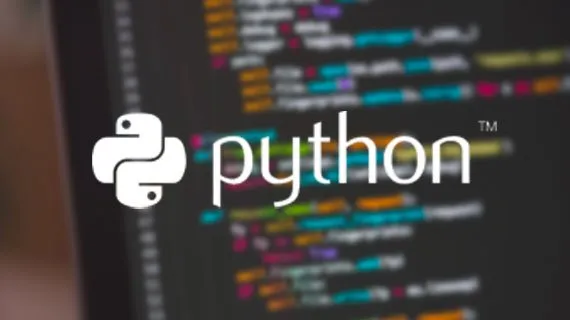
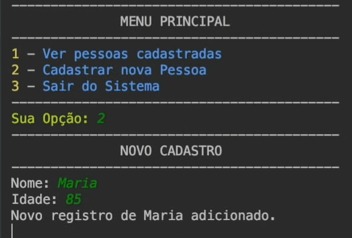

# **Simple Python CRUD APP**
This is my implementation of the last project of the Curso em Video's Python 3 Course 
From Curso em Video 
**Python Project**

This project is a challenge proposed within the Python 3 course of the 'Curso em Video'. In this project my objective was to create a CRUD system that runs inside the command prompt, the app needed to be able to manage user registration, user removal and so on.

# Table of Contents
- [**Simple Python CRUD APP**](#simple-python-crud-app)
- [Table of Contents](#table-of-contents)
- [Project Requirements](#project-requirements)
- [PROJECT ASSUMPTIONS](#project-assumptions)
- [Solution Planning](#solution-planning)
  - [Final Product](#final-product)
  - [Tech Stack](#tech-stack)
  - [Process and Methods](#process-and-methods)
- [Conclusion](#conclusion)
- [References](#references)
- [Next Steps](#next-steps)

# Project Requirements
1. Create a menu in the terminal (cmd) with Python, containing 4 screens:
    *   Main menu: View registered users; Register new users; Log out from the system;
    *   Sign-up page: Username; Age; Password
    *   Page displaying all registered users
    *   User update page
2. Exception Handling
3. Menu styling
4. Use file modularization
5. Store data in a simple txt file
6. Python 3

# PROJECT ASSUMPTIONS
* Use the knowledge learned during the course to create this solution
* Create different python files to handle different sections of the project, thus exercising modularization
* Practice manipulating files with Python, reading and writing user's data to a .txt file
* Exercise solution planning and develop practical solutions with Python 3

# Solution Planning
## Final Product
Deliver a python project that contains several .py files and 1 .txt file, which together contain a CRUD application - which runs in the terminal (cmd) - for registering people. This application must have stylized menus with different colors, which allow a user to choose between options and type the chosen option, including exiting the system.

## Tech Stack
* Python

## Process and Methods
* Task 1:
    * Method: 
        Create a modularized Python Script that displays a 'menu' on the terminal
* Task 2:
    * Method: 
        Create a 'data.txt' file to store user data
* Task 3:
    * Method: 
        Create the necessary code to properly read user input and execute the desired task from the menu
* Task 4:
    * Method: 
        Create functions to create and read user data from the 'data.txt' file
* Task 5:
    * Method: 
        Log in the user in the system
* Task 6:
    * Method: 
        Show a second menu with further options
* Task 7:
    * Method: 
        Create the code for those options
* Task 8:
    * Method: the number of samples
        Create Exit buttons
* Task 9:
    * Method: 
        Handle errors and perform unit tests
* Task 10:
    * Method: 
        Deploy code on Github
* Task 11:
    * Method:
        Document verything in the README

# Conclusion
This project was meant to be the final exercise of a series of more than 100 python exercise in this course, it's implementation demand me to use key concepts in programming, like conditional statements, loops, dealing with user input, exception handling, handling files with Python and etc. I successfully finished and finished the course.  

# References
- [Curso em Video's Python 3 Course](https://www.youtube.com/watch?v=S9uPNppGsGo&list=PLvE-ZAFRgX8hnECDn1v9HNTI71veL3oW0)

# Next Steps
- Create a GUI for this application, to extend it out of the terminal.
- Store user data in a relational database.